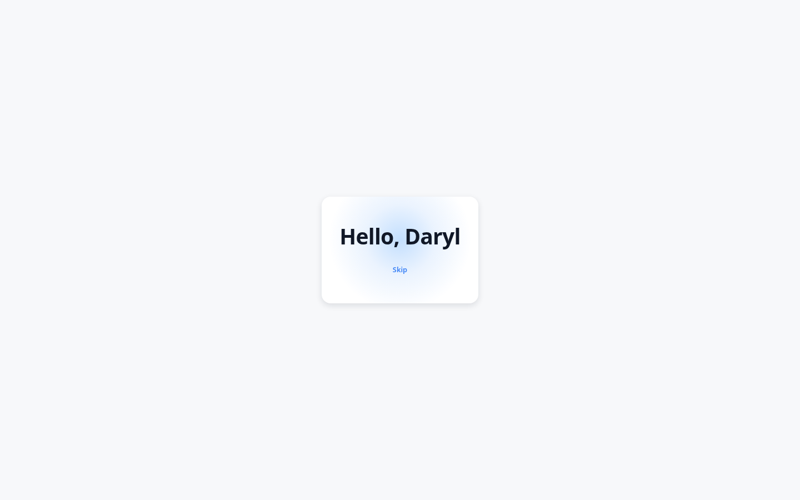
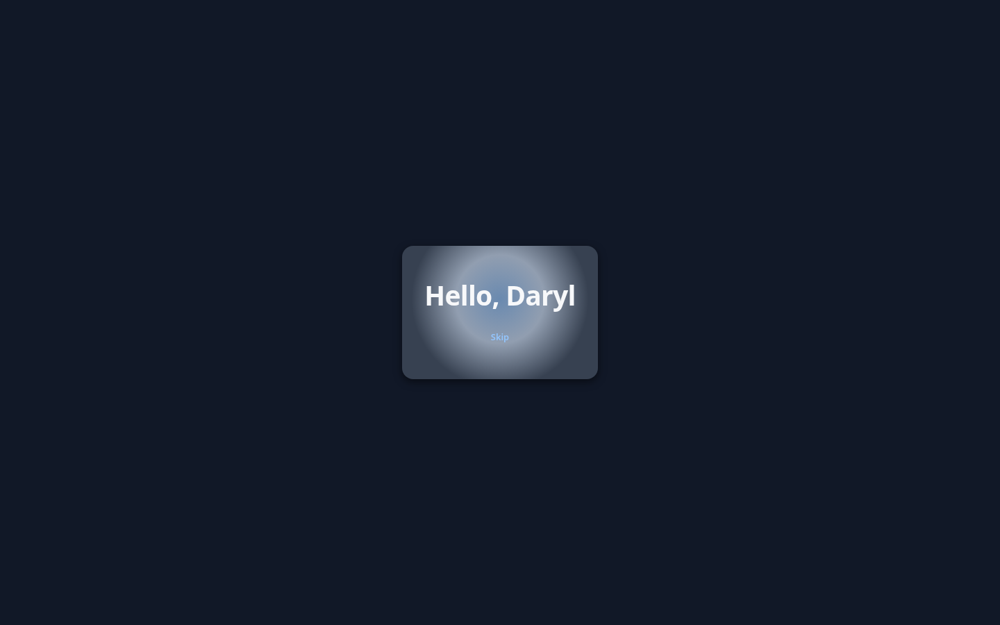
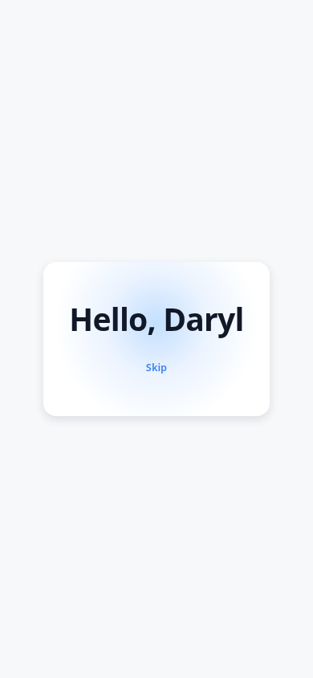

# Hello Daryl

A small, polished landing screen built with React 18 + TypeScript and a
hand-rolled design system (plain CSS custom properties — zero UI dependencies).

## ⚠️ Important — dependencies are NOT installed

This project was authored in a sandbox where the **npm registry was
unreachable** (network mode `INTEGRATIONS_ONLY`). As a result:

- `node_modules` does **not** exist and there is **no lockfile**.
- Nothing was built, type-checked, or linted here.
- Every file is hand-written so the project is correct the moment you have a
  registry available.

To run it locally you must first install dependencies:

```sh
npm install
npm run dev
```

`npm install` requires network access to the npm registry.

## Tech stack

- **React 18** (`react`, `react-dom`) — the only runtime dependencies
- **TypeScript 5** (strict mode)
- **Vite 5** with `@vitejs/plugin-react`

## Getting started (requires network access)

```sh
npm install        # install dependencies (needs registry access)
npm run dev        # start the Vite dev server
npm run build      # tsc --noEmit + vite build
npm run preview    # preview the production build
```

## Project structure

```
hello-daryl/
├── index.html
├── package.json
├── tsconfig.json
├── tsconfig.node.json
├── vite.config.ts
└── src/
    ├── main.tsx            # React 18 entry (createRoot)
    ├── App.tsx             # landing screen
    ├── App.css
    ├── vite-env.d.ts
    ├── components/         # design-system components (+ barrel index.ts)
    │   ├── Button.tsx / Button.css
    │   ├── Card.tsx   / Card.css
    │   ├── Badge.tsx  / Badge.css
    │   └── Stack.tsx  / Stack.css
    ├── hooks/
    │   └── useTheme.ts     # light/dark theme with localStorage persistence
    └── styles/
        ├── tokens.css      # design tokens (CSS custom properties)
        └── global.css      # reset + base element styles
```

## Design system

The token system is layered:

1. **Raw ramps** — a neutral ramp (8 shades) and an accent ramp (4 shades),
   plus theme-independent scales: a modular type scale, a spacing scale, border
   radii, shadows, transition durations/easings, and font stacks. These live on
   `:root` in `src/styles/tokens.css`.
2. **Semantic aliases** — `--surface`, `--surface-raised`, `--text`,
   `--text-muted`, `--border`, `--accent`, `--accent-contrast`, and the shadow
   tokens. Components consume **only** these semantic aliases (and the ramps for
   badge backgrounds), never hard-coded colours.
3. **Theming** — light is the `:root` default. Dark mode is provided two ways:
   - `@media (prefers-color-scheme: dark)` follows the OS preference when the
     user has not made an explicit choice.
   - `[data-theme="light"]` / `[data-theme="dark"]` override the OS preference
     when the user toggles.

The `useTheme` hook (`src/hooks/useTheme.ts`) reads the OS preference via
`matchMedia`, lets the user toggle light/dark, writes the choice to
`document.documentElement`'s `data-theme` attribute, and persists it to
`localStorage` under the key **`hello-daryl-theme`**.

## Components

All components live in `src/components/` and are re-exported from
`src/components/index.ts`.

| Component | Props |
| --- | --- |
| **Button** | `variant?: 'primary' \| 'secondary' \| 'ghost'` (default `'primary'`), `size?: 'sm' \| 'md' \| 'lg'` (default `'md'`), `disabled?: boolean` (default `false`), `onClick?: (event) => void`, `aria-label?: string`, `children` |
| **Card** | `children`, `className?: string` |
| **Badge** | `children`, `variant?: 'neutral' \| 'accent'` (default `'neutral'`) |
| **Stack** | `direction?: 'row' \| 'column'` (default `'column'`), `gap?: 1 \| 2 \| 3 \| 4 \| 6 \| 8 \| 12` (default `4`), `children`, `className?: string` |
| **Splash** | `onDismiss?: () => void`, `durationMs?: number` (default `2200`) |

Each component ships its own token-only CSS file, imported at the top of the
component module.

### Splash

`Splash` is an animated, theme-aware intro overlay that greets the user with a
large, centered **"Hello, Daryl"** wordmark before revealing the landing
content. It is rendered by `App` on initial load and dismisses itself
automatically after `durationMs` (default **2200 ms**); a focusable **Skip**
button lets users dismiss it immediately.

Highlights:

- **Token-only styling** — colours, spacing, radii, shadows, typography, and
  easing all come from the design tokens in `src/styles/tokens.css`. There are
  no hard-coded colours.
- **CSS keyframe animations** — a staggered per-letter entrance
  (`animation-delay: calc(var(--i) * 60ms)`), a pulsing radial accent glow, and
  a panel fade/drift on mount.
- **Theme-aware** — automatically adapts to light/dark because it consumes the
  semantic theme aliases.
- **Reduced motion** — a `@media (prefers-reduced-motion: reduce)` block
  disables the animations and shows the final resting state instantly.
- **Accessible** — the overlay is a labelled `role="dialog"` region, the
  wordmark exposes a single accessible name via `aria-label` (per-letter spans
  are `aria-hidden`), and the Skip button is auto-focused with the global
  focus-visible ring.

Props:

| Prop | Type | Default | Description |
| --- | --- | --- | --- |
| `onDismiss` | `() => void` | — | Called when the splash auto-dismisses or the Skip button is clicked. |
| `durationMs` | `number` | `2200` | How long (ms) the splash stays before auto-dismissing. |

## Screenshots

The splash screen rendered in its final (resting) state. A dependency-free
static reproduction lives at `docs/preview/splash-preview.html` (supports
`?theme=dark`); the images below were captured from it with headless Chrome.

### Light — desktop (1440×900)



### Dark — desktop (1440×900)



### Mobile (390×844)



## Testing

Unit tests are authored with [Vitest](https://vitest.dev/) and
[Testing Library](https://testing-library.com/) (jsdom environment). Config
lives in `vitest.config.ts` with a jsdom setup file at `src/test/setup.ts`;
tests are co-located under `src/components/__tests__/`.

```sh
npm run test        # run once (vitest run)
npm run test:watch  # watch mode
```

> As with the rest of the project, the test dependencies are declared in
> `package.json` but not installed in this sandbox (no registry access), so the
> tests are authored-only and have not been executed here.
